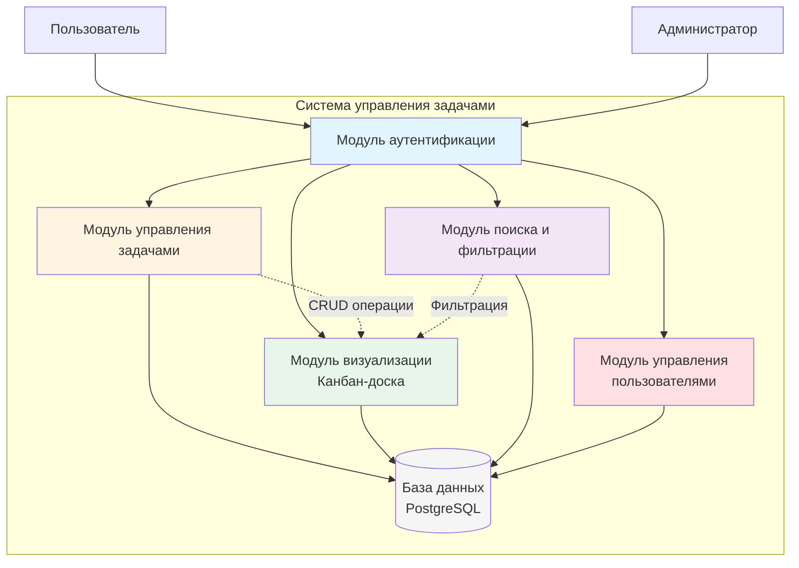

# 1.5 ТЕХНИЧЕСКОЕ ЗАДАНИЕ НА РАЗРАБОТКУ СИСТЕМЫ

Система предназначена для автоматизации управления задачами в ООО «Асофт21». Цели: единое информационное пространство, сокращение временных затрат, прозрачность процессов, исключение дублирования работы.

## 1.5.1 Функциональные требования

**Управление задачами:** создание (название, описание, приоритет, статус, срок), редактирование с историей, удаление с подтверждением, изменение статуса, назначение исполнителя.

**Визуализация:** канбан-доска с 5 статусами («Нужно сделать», «В процессе», «На проверке», «Готово», «Отменено»), визуальные приоритеты (синий/оранжевый/красный/огонь), выделение просроченных задач, счётчики.

**Поиск:** полнотекстовый поиск, фильтрация по статусу/приоритету/исполнителю, сброс фильтров.

**Пользователи:** регистрация (email, пароль ≥6 символов), аутентификация (сессия 24 часа), редактирование профиля с согласованием.

**Права доступа:** 
- Администратор — полный доступ, управление пользователями, справочниками.
- Пользователь — создание задач, просмотр всех, редактирование своих, изменение статуса назначенных.

**Рисунок 1 — Структурная схема функций системы**

## 1.5.2 Нефункциональные требования

**Надёжность:** доступность 99% рабочего времени, транзакционная целостность данных, резервное копирование БД ежедневно (хранение 30 дней).

**Производительность:** отклик ≤2 сек (95% запросов), CRUD операций ≤1 сек, загрузка канбан-доски (100 задач) ≤3 сек, поддержка 20 одновременных пользователей.

**Безопасность:** bcrypt-хеширование паролей, HTTPS (TLS 1.2+), параметризованные SQL-запросы, проверка прав при каждом запросе.

**Интерфейс:** интуитивный, освоение ≤30 мин, русский язык, адаптивный (от 1366×768), общепринятые иконки.

**Технические средства:**
- Сервер: Ubuntu 20.04+, PostgreSQL 13+, Node.js 18+, RAM 4ГБ, HDD 20ГБ.
- Клиент: Chrome 90+/Firefox 88+/Safari 14+/Edge 90+, разрешение от 1366×768.

## 1.5.3 Этапы разработки

1. Проектирование — БД (7 таблиц), API-маршруты, компоненты интерфейса.
2. Серверная часть — API, аутентификация, подключение PostgreSQL.
3. Клиентская часть — React/TypeScript, канбан-доска, формы, модальные окна.
4. Интеграция — HTTP-запросы, маршрутизация Next.js.
5. Тестирование — функциональное, кросс-браузерное, нагрузочное (20 пользователей).
6. Развёртывание — установка на сервер ООО «Асофт21».

## 1.5.4 Критерии приёмки

Реализация всех функций, производительность по нормативам, отсутствие критических ошибок, положительная оценка 80% тестировщиков. Составление акта приёмки с указанием замечаний.

Техническое задание определяет назначение, требования и порядок разработки системы управления задачами для ООО «Асофт21».
