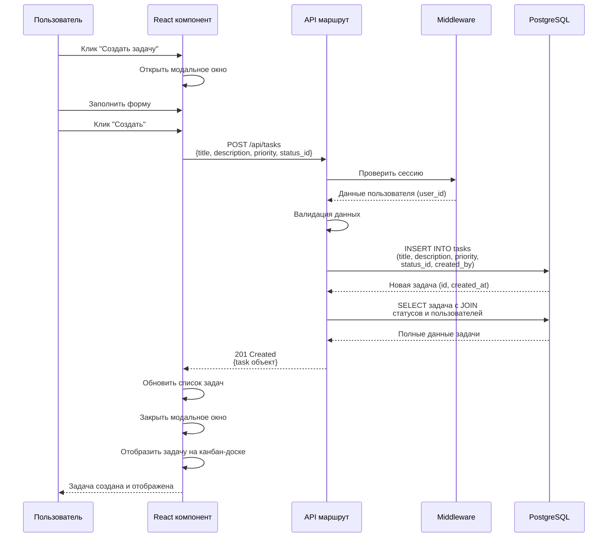

# 2.1 ПРОЕКТИРОВАНИЕ АРХИТЕКТУРЫ ПРИЛОЖЕНИЯ

Архитектура системы управления задачами построена на основе фреймворка Next.js версии 14, который обеспечивает единую кодовую базу для клиентской и серверной частей приложения. Данный подход позволяет использовать язык TypeScript на всех уровнях системы, что упрощает разработку и поддержку кода.

## 2.1.1 Общая архитектура системы

Система реализована по трёхуровневой архитектуре, включающей уровень представления, уровень бизнес-логики и уровень данных. Каждый уровень выполняет специфические функции и взаимодействует с соседними уровнями через определённые интерфейсы.

**Уровень представления** реализован в виде веб-интерфейса с использованием библиотеки React и компонентов Next.js. Данный уровень отвечает за отображение информации пользователю, обработку действий пользователя и отправку запросов на серверную часть. Компоненты разделены на серверные (Server Components) и клиентские (Client Components) в соответствии с методологией Next.js 14.

**Уровень бизнес-логики** представлен API-маршрутами Next.js, расположенными в директории app/api. Маршруты обрабатывают HTTP-запросы от клиентской части, выполняют валидацию входных данных, реализуют бизнес-правила и формируют запросы к базе данных. Каждый маршрут соответствует определённой сущности или операции системы.

**Уровень данных** построен на СУБД PostgreSQL и обеспечивает хранение всей информации системы в реляционных таблицах. Взаимодействие с базой данных осуществляется через библиотеку pg, которая предоставляет интерфейс для выполнения SQL-запросов из Node.js окружения.

```mermaid
graph TB
    subgraph "Уровень представления"
        Browser[Веб-браузер]
        UI[React компоненты]
        Kanban[Канбан-доска]
        Forms[Формы управления]
        Modal[Модальные окна]
    end
    
    subgraph "Уровень бизнес-логики"
        NextJS[Next.js Server]
        AuthAPI[/api/auth/*]
        TasksAPI[/api/tasks/*]
        UsersAPI[/api/users/*]
        StatusAPI[/api/statuses/*]
        Middleware[Middleware аутентификации]
    end
    
    subgraph "Уровень данных"
        PG[(PostgreSQL)]
        Tables[7 таблиц:<br/>users, roles, positions,<br/>tasks, task_statuses,<br/>task_comments,<br/>profile_change_requests]
    end
    
    Browser --> UI
    UI --> Kanban
    UI --> Forms
    UI --> Modal
    
    UI -->|HTTP/HTTPS| NextJS
    
    NextJS --> Middleware
    Middleware --> AuthAPI
    Middleware --> TasksAPI
    Middleware --> UsersAPI
    Middleware --> StatusAPI
    
    AuthAPI --> PG
    TasksAPI --> PG
    UsersAPI --> PG
    StatusAPI --> PG
    
    PG --> Tables
    
    style Browser fill:#e3f2fd
    style NextJS fill:#fff3e0
    style PG fill:#f3e5f5
```

**Рисунок 1 — Трёхуровневая архитектура системы**

## 2.1.2 Архитектура клиентской части

Клиентская часть организована по компонентному принципу с использованием библиотеки React. Каждый компонент инкапсулирует определённую функциональность и может быть повторно использован в различных частях приложения.

Главная страница приложения (app/page.tsx) является клиентским компонентом, управляющим состоянием всего приложения. Состояние включает список задач, список статусов, информацию о текущем пользователе, состояние модальных окон и параметры фильтрации. Управление состоянием осуществляется с помощью хуков useState и useEffect из библиотеки React.

Компонент KanbanBoard отвечает за визуализацию задач в виде канбан-доски. Он получает список задач и статусов через свойства (props), группирует задачи по статусам и отображает их в соответствующих колонках. Каждая колонка содержит заголовок с названием статуса, цветовым индикатором и счётчиком задач.

Компонент TaskCard представляет отдельную задачу в виде карточки. Карточка содержит название задачи, краткое описание, визуальный индикатор приоритета, срок выполнения и кнопки действий (редактирование, удаление). Компонент принимает объект задачи и функции-обработчики действий через свойства.

Модальные окна реализованы отдельными компонентами: CreateTaskModal для создания задач, EditTaskModal для редактирования, AuthModal для аутентификации и регистрации. Каждое модальное окно отображается поверх основного содержимого с затемнённым фоном и закрывается по клику вне области окна или кнопке закрытия.

Компонент Header обеспечивает навигацию и отображает информацию о текущем пользователе. Он содержит логотип приложения, строку поиска, кнопку создания задачи и меню пользователя с возможностью выхода из системы.

## 2.1.3 Архитектура серверной части

Серверная часть построена на API-маршрутах Next.js, которые обрабатывают HTTP-запросы и выполняют операции с данными. Маршруты организованы по функциональным областям и размещены в директории app/api.

Маршрут /api/auth обрабатывает операции аутентификации и авторизации. Подмаршруты включают /login для входа пользователей, /register для регистрации новых пользователей, /logout для завершения сессии, /me для получения информации о текущем пользователе. При успешной аутентификации создаётся защищённая сессия с использованием HTTP-only cookies.

Маршрут /api/tasks предоставляет полный набор операций CRUD для работы с задачами. GET-запрос возвращает список всех задач с возможностью фильтрации по статусу и приоритету. POST-запрос создаёт новую задачу с валидацией обязательных полей. Маршрут /api/tasks/[id] обрабатывает операции с конкретной задачей: GET для получения деталей, PUT для обновления, DELETE для удаления.

Маршрут /api/users управляет пользователями системы. GET-запрос доступен только администраторам и возвращает список всех пользователей. Маршрут /api/admin/users предоставляет административные функции: изменение ролей, блокировку учётных записей.

Маршрут /api/statuses возвращает список доступных статусов задач из справочника. Данный маршрут используется для заполнения выпадающих списков при создании и редактировании задач.

Все маршруты, кроме /api/auth/login и /api/auth/register, защищены middleware аутентификации, который проверяет наличие действительной сессии пользователя. При отсутствии сессии возвращается HTTP-статус 401 Unauthorized.



**Рисунок 2 — Диаграмма последовательности создания задачи**

## 2.1.4 Организация взаимодействия компонентов

Взаимодействие между клиентской и серверной частями осуществляется по протоколу HTTP с использованием формата JSON для передачи данных. Клиентская часть отправляет запросы с помощью Fetch API, встроенного в современные браузеры.

При монтировании главной страницы выполняется серия начальных запросов для загрузки необходимых данных. Запрос к /api/auth/me проверяет аутентификацию пользователя и получает его данные. Запрос к /api/tasks загружает список всех задач. Запрос к /api/statuses получает список доступных статусов для отображения колонок канбан-доски.

При выполнении действий пользователя (создание, редактирование, удаление задачи) отправляются соответствующие HTTP-запросы. После успешного выполнения операции на сервере клиентская часть обновляет локальное состояние, что приводит к автоматической перерисовке компонентов React.

Обработка ошибок организована на двух уровнях. Серверная часть возвращает HTTP-статусы ошибок (400, 401, 403, 404, 500) и объект с описанием ошибки в формате JSON. Клиентская часть отображает сообщения об ошибках пользователю через всплывающие уведомления или встроенные элементы форм.

## 2.1.5 Масштабируемость архитектуры

Архитектура системы обеспечивает возможность масштабирования при росте нагрузки и расширении функциональности. Трёхуровневая структура позволяет независимо масштабировать каждый уровень в зависимости от потребностей.

При увеличении числа пользователей возможно горизонтальное масштабирование серверной части через развёртывание нескольких экземпляров Next.js приложения за балансировщиком нагрузки. Сессии пользователей хранятся в базе данных или внешнем хранилище (Redis), что обеспечивает их доступность из любого экземпляра приложения.

База данных PostgreSQL поддерживает вертикальное масштабирование через увеличение ресурсов сервера и горизонтальное масштабирование через репликацию для распределения нагрузки чтения. Использование индексов на часто запрашиваемых полях обеспечивает высокую производительность при большом объёме данных.

Компонентная архитектура клиентской части позволяет легко добавлять новые функции через создание дополнительных компонентов без изменения существующего кода. API-маршруты организованы по принципу REST, что упрощает расширение функциональности через добавление новых эндпоинтов.

```mermaid
graph LR
    subgraph "Клиентская часть"
        C1[Компоненты React]
        C2[Состояние приложения]
        C3[HTTP клиент]
    end
    
    subgraph "API слой"
        A1[/api/auth]
        A2[/api/tasks]
        A3[/api/users]
        A4[/api/statuses]
    end
    
    subgraph "Слой данных"
        D1[Модуль db.ts]
        D2[SQL запросы]
        D3[(PostgreSQL)]
    end
    
    C1 --> C2
    C2 --> C3
    
    C3 -->|POST /api/auth/login| A1
    C3 -->|GET /api/tasks| A2
    C3 -->|POST /api/tasks| A2
    C3 -->|GET /api/users| A3
    C3 -->|GET /api/statuses| A4
    
    A1 --> D1
    A2 --> D1
    A3 --> D1
    A4 --> D1
    
    D1 --> D2
    D2 --> D3
    
    style C1 fill:#e8f5e9
    style A1 fill:#fff9c4
    style A2 fill:#fff9c4
    style A3 fill:#fff9c4
    style A4 fill:#fff9c4
    style D3 fill:#e1bee7
```

**Рисунок 3 — Схема взаимодействия компонентов системы**

В результате проектирования архитектуры определена трёхуровневая структура системы с чётким разделением ответственности между уровнями. Использование фреймворка Next.js обеспечивает единую технологическую платформу для разработки клиентской и серверной частей. Компонентная организация кода и REST API создают основу для дальнейшего расширения функциональности системы.
