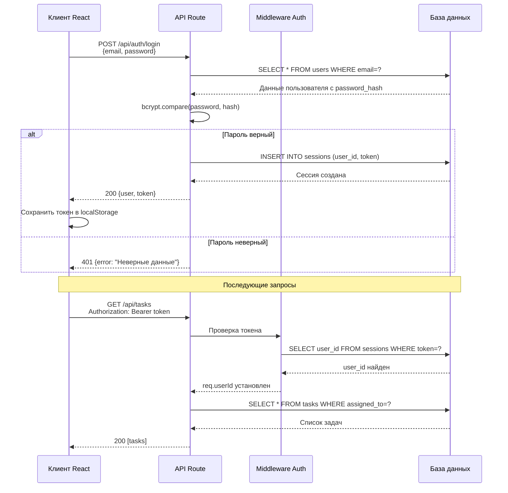
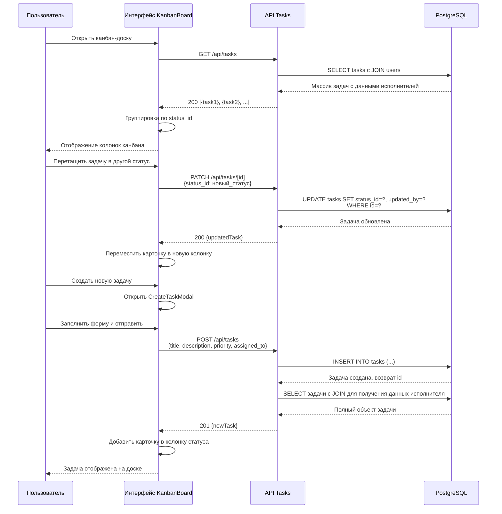

# 2.4 ОПИСАНИЕ ИНТЕРФЕЙСОВ ВЗАИМОДЕЙСТВИЯ КОМПОНЕНТОВ СИСТЕМЫ

Компоненты системы взаимодействуют через REST API с использованием протокола HTTP и формата данных JSON. Клиентская часть отправляет запросы к серверным маршрутам, получает ответы и обновляет интерфейс. Все запросы проходят проверку аутентификации через middleware, анализирующий HTTP-заголовок Authorization с токеном сессии.

## Интерфейсы аутентификации и управления профилем

Группа маршрутов /api/auth обеспечивает регистрацию, вход, выход и управление профилем пользователя. Маршрут POST /api/auth/register принимает объект с полями email, username, password, first_name, last_name. Пароль хешируется с применением bcrypt и сохраняется в таблицу users. Ответ содержит объект пользователя без password_hash и HTTP-статус 201 при успехе.

Маршрут POST /api/auth/login принимает email и password, проверяет совпадение хеша через bcrypt.compare, при успехе создаёт запись сессии и возвращает объект пользователя с полями id, email, username, first_name, last_name, avatar, role_id, position_id. Маршрут POST /api/auth/logout удаляет сессию из хранилища. Маршрут GET /api/auth/me возвращает данные текущего пользователя по токену сессии.

Маршрут POST /api/auth/profile создаёт запрос на изменение имени и фамилии, сохраняя запись в таблицу profile_change_requests со статусом «ожидает». Администратор через маршрут PATCH /api/profile-requests/[id] одобряет или отклоняет запрос. При одобрении данные переносятся в таблицу users, при отклонении указывается причина в поле reject_reason.

Диаграмма последовательности действий при аутентификации:

## Интерфейсы управления задачами

Маршрут GET /api/tasks возвращает список всех задач с возможностью фильтрации через query-параметры status, priority, assigned_to. Запрос формирует динамический SQL с условиями WHERE и параметризацией для защиты от инъекций. Ответ содержит массив объектов задач с полями id, title, description, status_id, priority, assigned_to, created_by, due_date, created_at, updated_at.

Маршрут POST /api/tasks создаёт новую задачу. Тело запроса содержит title (обязательное), description, status_id (по умолчанию 1), priority, assigned_to, due_date. Поле created_by устанавливается автоматически из req.userId. Валидация проверяет существование status_id в таблице task_statuses и assigned_to в таблице users. При успехе возвращается созданный объект задачи с HTTP-статусом 201.

Маршрут GET /api/tasks/[id] возвращает детальную информацию о задаче, включая комментарии через JOIN с таблицей task_comments. Маршрут PATCH /api/tasks/[id] обновляет указанные поля задачи. Проверяется право на изменение: автор задачи, исполнитель или администратор. Поле updated_by устанавливается в req.userId. При смене статуса на «выполнено» автоматически заполняется completed_at текущим timestamp.

Маршрут DELETE /api/tasks/[id] удаляет задачу с проверкой прав: только создатель или администратор. Комментарии удаляются автоматически через каскадное ограничение ON DELETE CASCADE в таблице task_comments.

Диаграмма последовательности работы с задачами:

## Интерфейсы справочных данных и администрирования

Маршрут GET /api/statuses возвращает список всех статусов задач из таблицы task_statuses, упорядоченных по sort_order. Ответ содержит массив объектов с полями id, name, color, description. Данные используются для построения колонок канбан-доски и выпадающих списков.

Маршрут GET /api/positions возвращает список должностей из таблицы positions для отображения в форме редактирования профиля. Маршрут GET /api/users возвращает список всех пользователей с полями id, email, username, first_name, last_name, position_id, role_id для выбора исполнителя задачи.

Маршрут GET /api/admin/users доступен только пользователям с role_id = 1 (администратор). Возвращает полный список пользователей с возможностью фильтрации. Маршрут PATCH /api/admin/users изменяет роль или должность пользователя. Проверка прав выполняется middleware, при отсутствии прав возвращается HTTP-статус 403.

Маршрут GET /api/profile-requests возвращает список запросов на изменение профиля для администратора. Каждый объект содержит поля id, user_id, first_name, last_name, status, created_at, а также данные пользователя через JOIN. Маршрут PATCH /api/profile-requests/[id] обновляет статус запроса на «одобрено» или «отклонено», устанавливает reviewed_by и reviewed_at.

## Форматы данных и обработка ошибок

Все запросы и ответы используют формат JSON с заголовком Content-Type: application/json. Даты передаются в формате ISO 8601 (YYYY-MM-DDTHH:mm:ss.sssZ). Токены сессии передаются в заголовке Authorization: Bearer <token>.

При ошибках валидации возвращается HTTP-статус 400 с объектом {error: "Описание ошибки"}. При отсутствии аутентификации — статус 401 с {error: "Требуется аутентификация"}. При отсутствии прав — статус 403 с {error: "Доступ запрещён"}. При отсутствии ресурса — статус 404 с {error: "Ресурс не найден"}. Серверные ошибки возвращают статус 500 с общим сообщением без раскрытия деталей реализации.

Клиентская часть обрабатывает ответы через проверку response.ok и отображает сообщения об ошибках пользователю через alert или встроенные уведомления в интерфейсе. Повторные запросы при сетевых ошибках не реализованы, пользователь должен повторить действие вручную.

Описанная структура интерфейсов обеспечивает полное взаимодействие между клиентской и серверной частями системы, предоставляя единообразный REST API для всех операций с задачами, пользователями и справочными данными.
